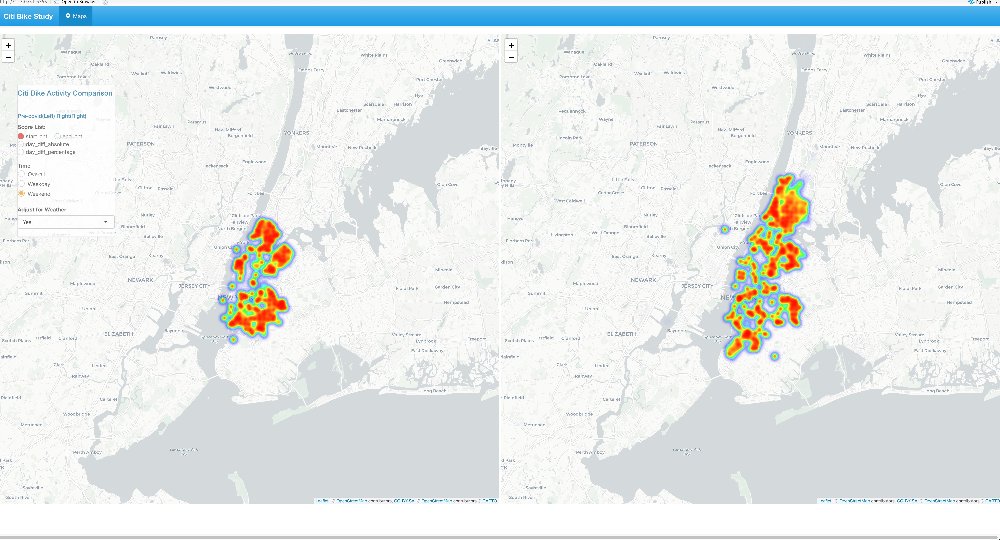

# Project 2: Shiny App Development

### [Project Description](doc/project2_desc.md)



In this second project of GR5243 Applied Data Science, we develop a *Exploratory Data Analysis and Visualization* shiny app on the work of a **NYC government agency/program** of your choice using NYC open data released on the [NYC Open Data By Agency](https://opendata.cityofnewyork.us/data/) website. In particular, many agencies have adjusted their work or rolled out new programs due to COVID, your app should provide ways for a user to explore quantiative measures of how covid has impacted daily life in NYC from different prospectives. See [Project 2 Description](doc/project2_desc.md) for more details.  

The **learning goals** for this project is:

- business intelligence for data science
- data cleaning
- data visualization
- systems development/design life cycle
- shiny app/shiny server

*The above general statement about project 2 can be removed once you are finished with your project. It is optional.

## NYC Crime Study
Term: Fall 2022

+ Team 3
+ [**NYC Crime Study**]( https://jiapeng-xu.shinyapps.io/NYC_Crime_Study/):
	+ Jinyang Cai
	+ Chengming He
	+ Jiapeng Xu

+ **Project summary**: In this project, we examined changes in crime-related data in New York City since the start of the COVID-19 pandemic in 2020, with a special emphasis on shooting incidents, hate crimes, homeless data, and total arrests. Using this web application, users can visualize data interactively and inspect the effects of the pandemic.

+ **Contribution statement**: ([default](doc/a_note_on_contributions.md)) Jinyang Cai, Chengming He and Jiapeng Xu designed the study together and designed the structure of the shiny app UI. Chengming He finished NYC Crime Comparison part in Maps tab. Jinyang Cai finished Arrest Data analysis. Jiapeng Xu finished Homeless Data analysis. All team members contributed equally in all stages of this project. All team members approve our work presented in this GitHub repository including this contributions statement.

Following [suggestions](http://nicercode.github.io/blog/2013-04-05-projects/) by [RICH FITZJOHN](http://nicercode.github.io/about/#Team) (@richfitz). This folder is orgarnized as follows.

```
proj/
├── app/
│   ├── README.md
│   ├── server.R
│   ├── ui.R
├── data/
│   ├── COVID-19_Daily_Counts_of_Cases__Hospitalizations__and_Deaths.csv
│   ├── DHS_Daily_Report.csv
│   ├── Individual_Census_by_Borough__Community_District__and_Facility_Type.csv
│   ├── NYPD_Hate_Crimes.csv
│   ├── NYPD_Shooting_Incident_Data__Historic_.csv
│   ├── New_York_City_Population_By_Community_Districts.csv
│   ├── nyc_community_districts.geojson
├── doc/
│   ├── figs/
│         ├── map.jpg
│   ├── README.md
│   ├── a_note_on_contributions.md
│   ├── preprocess.R
│   ├── project2_desc.md
├── lib/
│   ├── README.md
├── processed/
│   ├── nyc_arrest_processed.csv
│   ├── nyc_community_districts_processed.geojson
└── README.md
```

Please see each subfolder for a README file.

